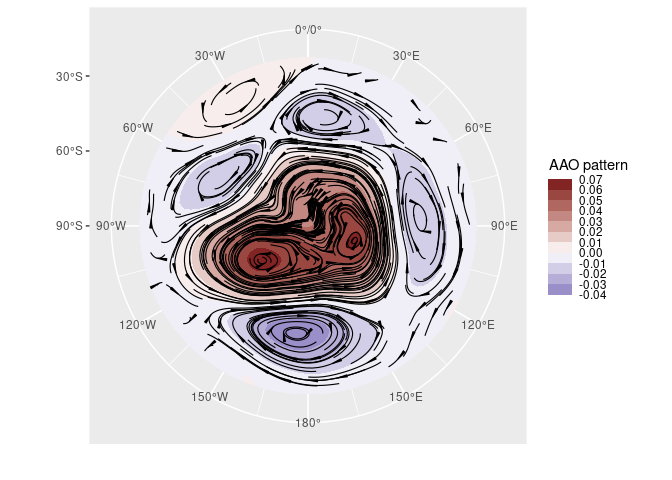
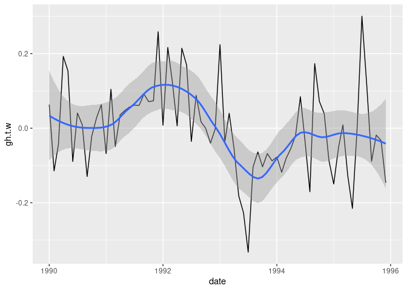

<!-- README.md is generated from README.Rmd. Please edit that file -->

# metR 

[](https://github.com/eliocamp/metR/actions)
[](https://codecov.io/github/eliocamp/metR/?branch=master)
[](https://cran.r-project.org/package=metR)
[](https://zenodo.org/badge/latestdoi/96357263)

metR packages several functions and utilities that make R better for
handling meteorological data in the tidy data paradigm. It started
mostly sa a packaging of assorted wrappers and tricks that I wrote for
my day to day work as a researcher in atmospheric sciences. Since then,
it has grown organically and for my own needs and feedback from users.

Conceptually it’s divided into *visualization tools* and *data tools*.
The former are geoms, stats and scales that help with plotting using
[ggplot2](https://ggplot2.tidyverse.org/index.html), such as
`stat_contour_fill()` or `scale_y_level()`, while the later are
functions for common data processing tools in the atmospheric sciences,
such as `Derivate()` or `EOF()`; these are implemented to work in the
[data.table](https://github.com/Rdatatable/data.table/wiki) paradigm,
but also work with regular data frames.

Currently metR is in development but maturing. Most functions check
arguments and there are some tests. However, some functions might change
it’s interface, and functionality can be moved to other packages, so
please bear that in mind.

## Installation

You can install metR from CRAN with:

``` r
install.packages("metR")
```

Or the development version ([](https://github.com/eliocamp/metR/actions?query=workflow%3AR-CMD-check))
with:

``` r
# install.packages("devtools")
devtools::install_github("eliocamp/metR@dev")
```

If you need to read netcdf files, you might need to install the netcdf
and udunits2 libraries. On Ubuntu and it’s derivatives this can be done
by typing

    sudo apt install libnetcdf-dev netcdf-bin libudunits2-dev

## Citing the package

If you use metR in your research, please consider citing it. You can get
citation information with

``` r
citation("metR")
#> 
#> To cite metR in publications use:
#> 
#> 
#> 
#> A BibTeX entry for LaTeX users is
#> 
#>   @Manual{,
#>     title = {metR: Tools for Easier Analysis of Meteorological Fields},
#>     author = {Elio Campitelli},
#>     year = {2021},
#>     note = {R package version 0.10.0},
#>     url = {https://github.com/eliocamp/metR},
#>     doi = {10.5281/zenodo.2593516},
#>   }
```

## Examples

In this example we easily perform Principal Components Decomposition
(EOF) on monthly geopotential height, then compute the geostrophic wind
associated with this field and plot the field with filled contours and
the wind with streamlines.

``` r
library(metR)
library(data.table)
library(ggplot2)
data(geopotential)
# Use Empirical Orthogonal Functions to compute the Antarctic Oscillation
geopotential <- copy(geopotential)
geopotential[, gh.t.w := Anomaly(gh)*sqrt(cos(lat*pi/180)),
      by = .(lon, lat, month(date))]
aao <- EOF(gh.t.w ~ lat + lon | date, data = geopotential, n = 1)
aao$left[, c("u", "v") := GeostrophicWind(gh.t.w, lon, lat)]

# AAO field
binwidth <- 0.01
ggplot(aao$left, aes(lon, lat, z = gh.t.w)) +
    geom_contour_fill(aes(fill = stat(level)), binwidth = binwidth,
                      xwrap = c(0, 360)) +    # filled contours!
    geom_streamline(aes(dx = dlon(u, lat), dy = dlat(v)), 
                    size = 0.4, L = 80, skip = 3, xwrap = c(0, 360)) +
    scale_x_longitude() +
    scale_y_latitude(limits = c(-90, -20)) +
    scale_fill_divergent_discretised(name = "AAO pattern") +
    coord_polar()
#> Warning in .check_wrap_param(list(...)): 'xwrap' and 'ywrap' will be deprecated.
#> Use ggperiodic::periodic insead.
```

<!-- -->

``` r
# AAO signal
ggplot(aao$right, aes(date, gh.t.w)) +
    geom_line() +
    geom_smooth(span = 0.4)
#> `geom_smooth()` using method = 'loess' and formula 'y ~ x'
```

<!-- -->

You can read more in the vignettes: [Visualization
tools](https://eliocamp.github.io/metR/articles/Visualization-tools.html)
and [Working with
data](https://eliocamp.github.io/metR/articles/Working-with-data.html).
